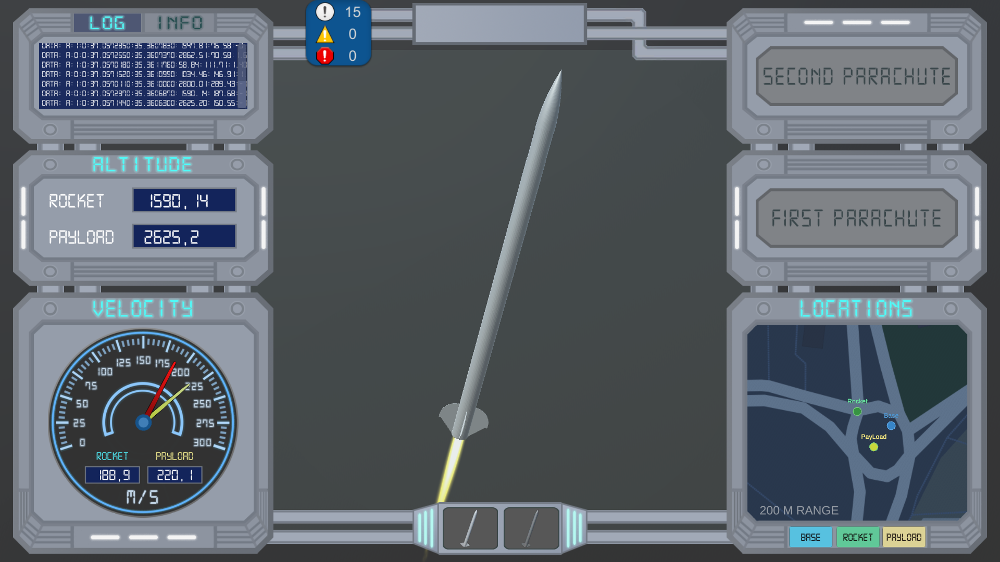
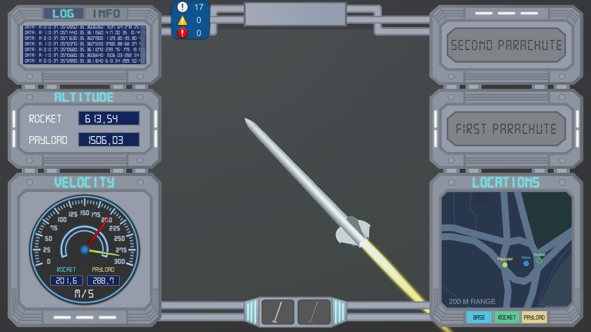
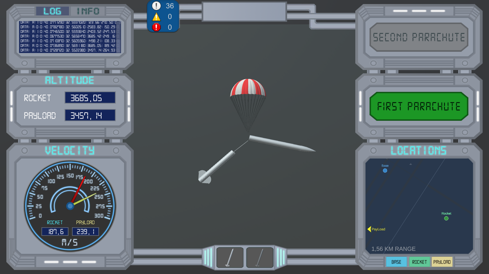
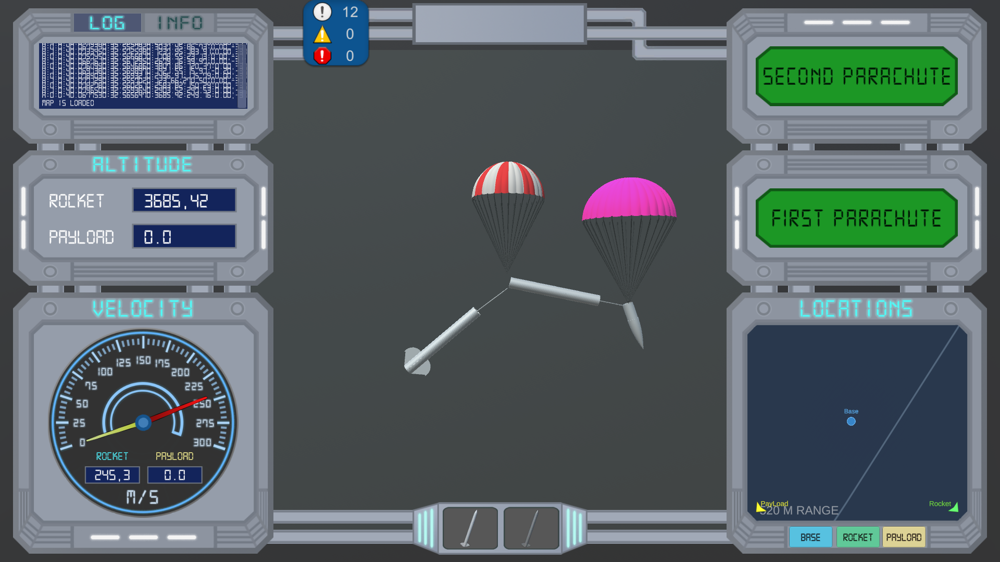

# rocket-base-station

This project is a base station made with Unity that monitors the flight of a model rocket. Data trasmission is done with telemetry system betweeen the rocket and a receiver on the ground. Receiver is connected to the pc on the ground via usb and sends a string of data to the computer. This data is evaluated and displayed.

  

On the top left corner, there is a log screen where the string data flow coming from serial port and some other log messages can be observed. Right below it, there is the altitude of the rocket and the payload. On the left bottom corner there is a speedometer that displays the velocities. On the up right side, parachute condition (whether they are open or not). Lastly on the bottom right corner, there is a map which also works offline.

The ingame debug console is pretty usefull in this project, you can check it out from https://github.com/yasirkula/UnityIngameDebugConsole.
Also for the map features, https://github.com/mapbox/mapbox-unity-sdk.

     

On the first parachute event, payload is released from the rocket body and the minimap can be used to track the location of it. Second parachute was for the rocket itself for its landing.

