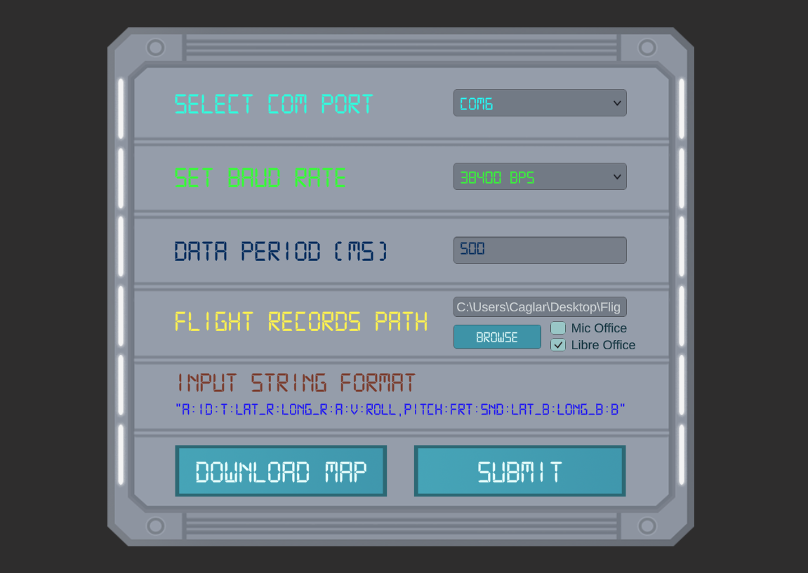

# rocket-base-station

This project is a base station made with Unity that monitors the flight of a model rocket. Data trasmission is done with telemetry system betweeen the rocket and a receiver on the ground. Receiver is connected to the pc on the ground via usb and sends a string of data to the computer. This data is evaluated and displayed.

  
